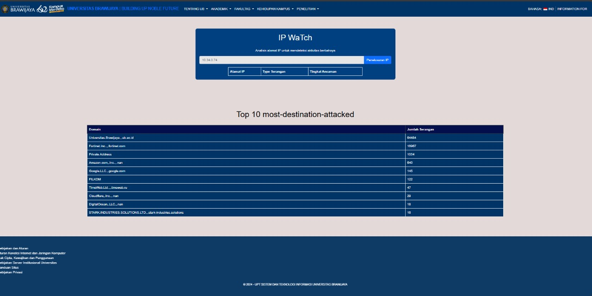

# Project Name

## Overview

**Ip Watch** is a responsive and user-friendly website designed to improve awareness of security for brawijaya university users. The project focuses on providing Users information about security in brawijaya university.


## Table of Contents

1. [Features](#features)
2. [Technologies Used](#technologies-used)
3. [Installation](#installation)
4. [Usage](#usage)
5. [Project Structure](#project-structure)
6. [Contributing](#contributing)
7. [License](#license)
8. [Contact](#contact)

## Features

- 🌟 **Responsive Design**: Adapts to various screen sizes for an optimal user experience on all devices.
- 🔒 **Secure Authentication**: Features a login and registration system with data validation. (ongoing)
- ⚡ **High Performance**: Optimized loading speeds and performance through best practices.(ongoing)
- 📊 **Data Visualization**: Graphs and charts to display data insights. (ongoing)
- 🌍 **Multi-language Support**: Available in multiple languages.

## Technologies Used

- **Frontend**: HTML5, CSS3, JavaScript, Vue.js (ongoing)
- **Backend**: Node.js (ongoing), php
- **Database**: MySQL
- **Other**: Bootstrap,

## Installation

Follow these steps to set up the project locally:

1. **Clone the repository**:
   ```bash
   git clone https://github.com/Abi-Hurairah/IPWatch.git

## Contact
Author: SatyaBuana
GitHub: https://github.com/SatyaBuana